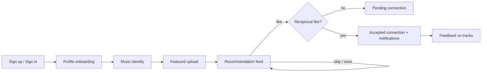
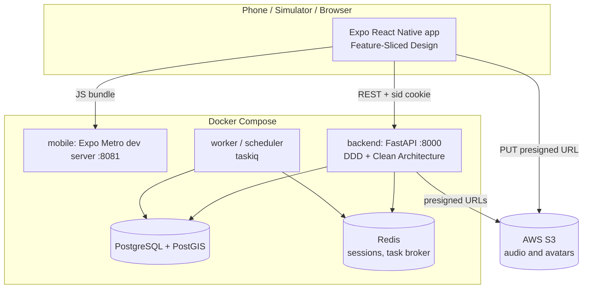
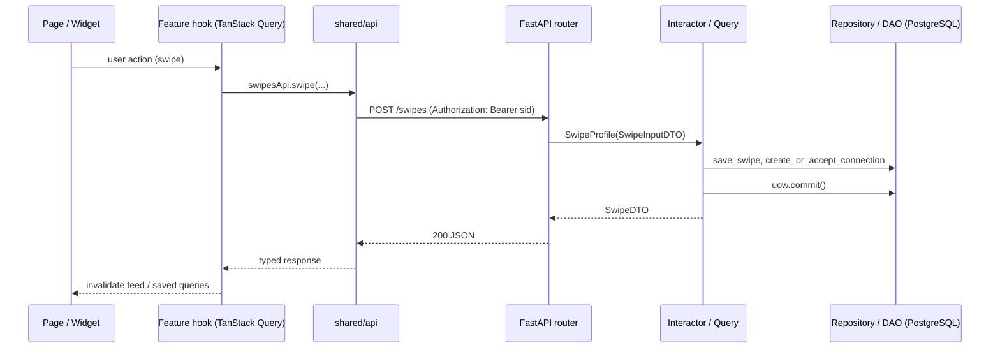
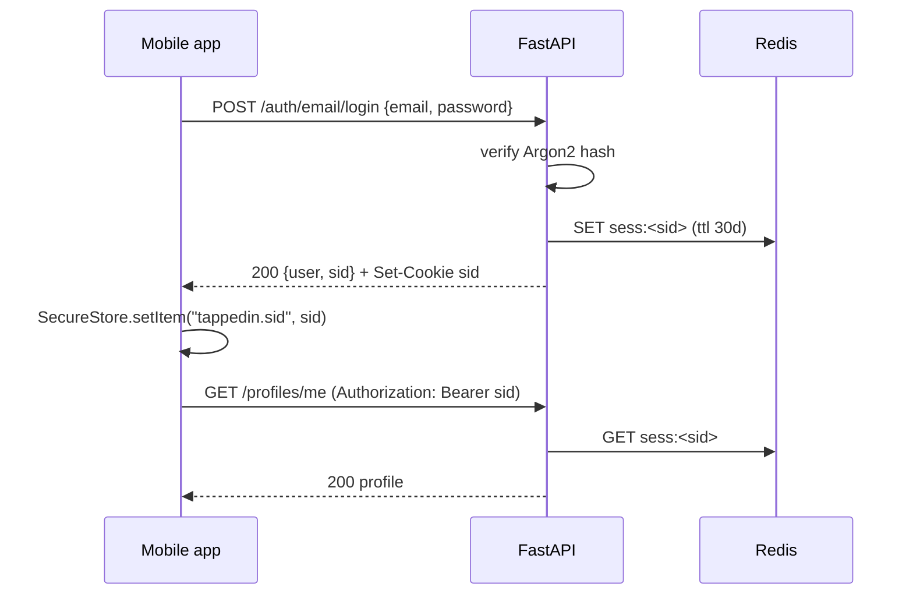
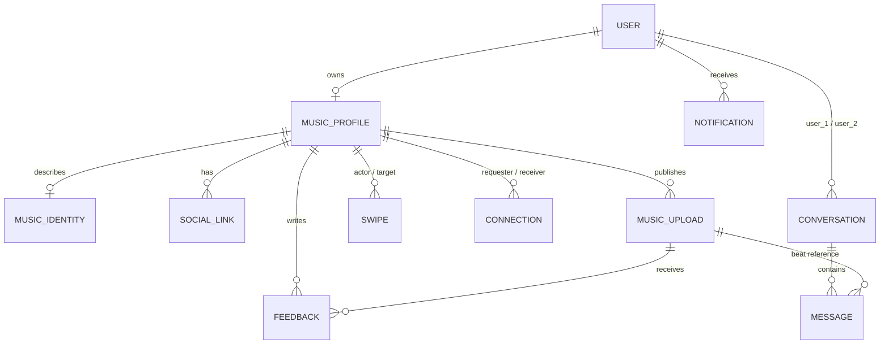

# TappedIn

**Discover people by their sound, not by their follower count.**

Project documentation

TappedIn is a mobile-first discovery and networking app for music artists and producers. It works like "Tinder for music collaboration": you create a music identity, upload one featured track, get a feed of people whose sound matches yours, listen, swipe, connect and leave feedback. It is built as a production-style monorepo: an Expo React Native client organised with Feature-Sliced Design, a FastAPI backend organised with DDD and Clean Architecture, and a Docker Compose setup that starts the whole stack with one command.

Detailed documentation:

- [Client docs](docs/client.md) - Feature-Sliced Design, layers, import rules, API and session handling.
- [Server docs](docs/server.md) - DDD + Clean Architecture, DI, repositories/DAO/queries, migrations, endpoint reference.
- [MVP plan](docs/MVP-PLAN.md) - scope, screens, tables and API routers of the MVP.

## Problem and Solution

### The problem

Producers and artists find each other today through follower-driven social networks and random DMs:

- **Reach beats fit.** Discovery on Instagram, SoundCloud or YouTube is ranked by followers and algorithms, so a great unknown producer is invisible to the artist who would fit them perfectly.
- **Cold outreach is noisy.** Artists send dozens of "check my beats" messages; producers drown in them. Neither side can quickly tell whether the sound is compatible.
- **Feedback is hard to get.** Early-career creators rarely receive honest, structured feedback on a track.
- **Trust and context are missing.** Links, genres, influences and BPM live in different apps, so evaluating a potential collaborator takes minutes instead of seconds.

### Our solution

TappedIn replaces follower count with **musical compatibility**:

- **Music identity.** Every user describes themselves through genres, influences, type beats, mood and BPM range, plus social links.
- **One featured track.** A user presents themselves through one featured audio upload, so the first thing a visitor does is *listen*.
- **Deterministic match score.** The feed ranks candidates with a transparent weighted score (genre 35%, influences 30%, type beats 20%, location 10%, experience 5%) and shows the reasons behind it.
- **Swipe and mutual connection.** Skip, like or save a profile. When two people like each other the connection is accepted automatically; contact details are shown only after a connection exists.
- **Structured feedback.** Quick category chips (production, mix, vocals, flow, melody, arrangement, originality) and optional short text on any featured track.
- **Notifications.** Accepted connections and new feedback are surfaced in a minimal notification list.

Out of the original MVP scope (see the plan): subscriptions, studios nearby, CRM/export, audio embeddings, collaborative filtering. Direct messaging and beat sharing, originally out of scope, were added later as a small separate slice.

## Features

- **Auth.** Email + password sign up/login and phone login with a one-time code. The server issues an opaque session id (`sid`) stored in Redis.
- **Music profile.** Role (`artist` / `producer`), artist name, avatar, location, experience level, bio, collaboration status.
- **Music identity.** Genres, influences, type beats, moods, BPM range and social links (Instagram, Spotify, SoundCloud, YouTube, Telegram).
- **Featured upload.** One featured audio track per user; the file is uploaded straight to S3 through a presigned URL.
- **Recommendation feed.** Cards with audio player, profile summary and match score, filterable by role, genre and location.
- **Swipes.** `skip`, `like`, `save`; a reciprocal like creates an accepted connection.
- **Connections.** Request, accept and reject connections.
- **Feedback.** Quick or text feedback on an upload; the author of the track is notified.
- **Notifications.** `connection_accepted` and `new_feedback`.
- **Direct chat.** Once two users are connected they can open a conversation and exchange text messages and playable beats, with read receipts. (The [MVP plan](docs/MVP-PLAN.md) lists messaging as out of MVP; it was added on top of the MVP flow.)

## Key User Flows

1. **Onboarding.** Sign up -> complete profile (name, role, avatar, location, experience, bio) -> music identity (genres, influences, type beats, BPM, socials) -> upload a featured track.
2. **Discovery.** Open the feed -> listen to the preview track -> see the match score and reasons -> swipe or tap *connect* / *decline*.
3. **Match.** Both users like each other -> the connection becomes `accepted` -> both receive a `connection_accepted` notification -> contacts become visible in *Connections*.
4. **Feedback.** Open a profile or a track -> choose quick chips and optional text -> the owner receives a `new_feedback` notification.
5. **Profile management.** Edit profile, identity, socials and the featured upload from *My profile*.



## Architecture Overview

The repository is a monorepo with two applications and a Docker Compose layer on top.



- **Client** (`mobile/`): Expo SDK 57, React Native, Expo Router for navigation, NativeWind for styling, TanStack Query for server state and Zustand for local state. Source code follows [Feature-Sliced Design](docs/client.md).
- **Server** (`server/`): FastAPI application that follows DDD and Clean Architecture. Dependencies point inward, and Dishka wires everything together. See [Server docs](docs/server.md).
- **Infrastructure**: PostgreSQL (PostGIS image) for data, Redis for sessions and the taskiq broker, S3 for media, Alembic for migrations, Docker Compose for local orchestration.

### Request path



## Client and Server Interaction

- **Transport.** Plain REST over HTTP with JSON bodies. FastAPI also serves OpenAPI at `/docs` and `/openapi.json`; `/health` returns `{"status": "ok"}`.
- **API base URL.** The client reads `EXPO_PUBLIC_API_URL` (see `mobile/src/shared/config/env.ts`, default `http://localhost:8000`). The value is inlined into the JS bundle at build time and is used **by the app on the device**, not by the container, so it must be reachable from the device:

  | Where the app runs | `EXPO_PUBLIC_API_URL` |
  | --- | --- |
  | iOS Simulator, Expo Web | `http://localhost:8000` |
  | Android Emulator | `http://10.0.2.2:8000` |
  | Physical device (same Wi-Fi) | `http://<your-LAN-IP>:8000` |

- **Auth flow.**
  1. The client calls `POST /auth/signup`, `POST /auth/email/login` or `POST /auth/phone/verify`.
  2. The server creates a session in Redis (`sess:<sid>`, 30 days idle / 60 days absolute lifetime, bound to a hash of the `User-Agent`) and returns `{ user, sid }`. It also sets an HTTP-only `sid` cookie (useful for browsers).
  3. The client stores `sid` in `expo-secure-store` (`localStorage` on web) and sends `Authorization: Bearer <sid>` on every authenticated request in `shared/api/http-client.ts`.
  4. On the server `SessionIdProvider` reads `sid` from the cookie or from the `Authorization: Bearer` header, validates it through `SessionService` and exposes the current `UserId` to interactors. Missing or expired sessions return `401`.
  5. `POST /auth/logout` deletes the session and the client clears its stored `sid`.
- **Errors.** The server returns `{ "detail": "..." }`; the client wraps failures into `ApiError(status, detail, data)`.



## Repository Structure

```
tappedin/
├── mobile/                   # Expo React Native client (FSD)
│   ├── app/                  # Expo Router route files (thin re-exports of pages)
│   ├── src/                  # FSD layers: app, pages, widgets, features, entities, shared (+ components)
│   ├── assets/               # images, icons, audio
│   ├── Dockerfile            # Metro dev server image
│   └── docker-compose.{base,dev}.yml
├── server/                   # FastAPI backend (DDD + Clean Architecture)
│   ├── src/vnu/              # domain, application, adapters, presentation, entrypoint
│   ├── tests/                # server unit tests
│   ├── Dockerfile
│   └── docker-compose.{base,dev,test}.yml
├── tests/                    # root-level unit and end-to-end tests
├── docs/                     # detailed docs (client, server, MVP plan)
├── landing/                  # Next.js marketing landing page
├── docker-compose.yml        # root orchestration: includes server + mobile composes
├── Makefile                  # shortcuts: make up / down / logs / migrate / test
└── README.md
```

## Technology Stack

### Client

- Expo SDK 57, React Native 0.86, React 19
- TypeScript (strict)
- Expo Router (file-based navigation)
- NativeWind + Tailwind CSS, class-variance-authority, tailwind-merge
- TanStack Query (server state), Zustand (session state)
- expo-audio, expo-secure-store, expo-image-picker, expo-document-picker
- Jest + jest-expo + Testing Library, ESLint (expo config), Prettier
- bun lockfile

### Server

- Python 3.12
- FastAPI + Uvicorn
- SQLAlchemy 2.0 async + asyncpg
- Alembic (+ alembic-postgresql-enum)
- Dishka (dependency injection)
- Redis (sessions), taskiq + taskiq-redis (background jobs)
- Argon2 password hashing, TOTP/OTP for phone login
- boto3 (S3 presigned uploads)
- pytest + pytest-asyncio, Ruff
- uv for dependency management

### Infrastructure

- Docker and Docker Compose (`include`-based root orchestration)
- PostgreSQL 17 with PostGIS, Redis
- Make

## Data Model

Music data lives in separate tables next to the existing `user` table.



See [Server docs](docs/server.md#database-structure) for the table-by-table description.

## Testing

| Suite | Location | What it checks | Command |
| --- | --- | --- | --- |
| Server unit | `server/tests/` | domain rules (match score, swipe/connection invariants), interactors with in-memory fakes, session id provider | `make test-server` |
| Root unit | `tests/unit/` | feed shape, filtering, decline/send-request behaviour | `make test-root` |
| Root end-to-end | `tests/end2end/` | API contract of a running backend (health, 401s, OpenAPI routes); skipped when the backend is unreachable | `E2E_BASE_URL=http://localhost:8000 make test-root` |
| Mobile | `mobile/src/**/*.test.ts(x)` | API client behaviour (cookie injection, error normalisation) | `make test-mobile` |

Static checks: `make mobile-check` (TypeScript + ESLint) and Ruff for the server.

The tests prefer pure domain and application tests (no database, no network) and use a contract test against a real running backend for the HTTP surface. See [Server docs](docs/server.md#tests) and [Client docs](docs/client.md#testing).

## Trade-offs and Known Limitations

- **MVP scope.** No chat, no file sending, no subscriptions; contacts are exchanged through the connection flow only.
- **Deterministic scoring.** Match score is a transparent weighted set intersection, not ML. It is easy to explain and test but ignores audio content. The feed currently loads candidates and scores them in Python (`GetRecommendationFeed`), which is fine for MVP volumes but will need database-side filtering and caching at scale.
- **Opaque sessions instead of JWT.** Sessions are stored in Redis, which allows instant revocation but makes Redis a hard dependency of every authenticated request.
- **CORS for Expo Web.** The session travels in the `Authorization` header, so web works as long as the server CORS allow-list (`server/src/vnu/entrypoint/web.py`) contains the web origin (check the list there; `http://localhost:8081` must be present for Expo Web served by Metro).
- **Audio upload.** Files go to S3 through presigned URLs; this requires valid AWS credentials in `server/.env`. Without them the rest of the app still works, but uploads fail.
- **Client/server drift.** The client already calls `POST /auth/email/code` and `POST /auth/email/verify` (passwordless e-mail code sign-in); at the time of writing these routes are not yet registered on the server (see the endpoint list in the [Server docs](docs/server.md#api-reference)), so only e-mail + password sign-in and sign-up are guaranteed to work end to end.
- **Legacy template code.** The server still carries code from the original template (OTP, email, Mailchimp, SMS adapters, Telegram-related fields). It is wired but unused by the TappedIn MVP flows.
- **Docker volumes and Metro.** Hot reload through bind mounts depends on the file watcher of Docker Desktop; on slow file systems running Expo on the host is faster (see [mobile only](#4-run-only-the-mobile-app)).
- **Startup race.** `backend` starts together with PostgreSQL and retries (`restart: on-failure`) until the database accepts connections, so the first seconds of logs may contain a connection error.

---

# How to Run

## Prerequisites

- Docker with Docker Compose v2.20+ (the root compose file uses `include`)
- Make (optional, shortcuts only)
- For running parts without Docker: Python 3.12 + [uv](https://docs.astral.sh/uv/), Node.js 20+ (22 recommended) and npm or bun
- For a physical device: the Expo Go app (or a development build) on the same Wi-Fi network as your computer

## 1. Environment setup

```bash
make env            # creates server/.env and mobile/.env from the examples (never overwrites)
# or manually:
cp server/.env.example server/.env
cp mobile/.env.example mobile/.env
```

Edit `server/.env`: at least `DB_NAME`, `DB_USER`, `DB_PASSWORD` and `REDIS_PASSWORD`. AWS keys are needed only for audio/avatar uploads.

`server/.env` (backend, read by docker compose and by the app):

| Variable | Purpose |
| --- | --- |
| `DB_NAME`, `DB_USER`, `DB_PASSWORD` | PostgreSQL credentials (used both to create the DB and to connect) |
| `DB_HOST`, `DB_PORT` | `postgresql` / `5432` inside compose; compose overrides them. On the host the app falls back to `localhost:$LOCAL_DB_PORT` |
| `LOCAL_DB_PORT` | Host port of the PostgreSQL container (`5433`) |
| `REDIS_HOST`, `REDIS_PORT`, `REDIS_DB`, `REDIS_PASSWORD` | Redis connection; `LOCAL_REDIS_PORT` (`6380`) is used when the app runs on the host |
| `AWS_ACCESS_KEY_ID`, `AWS_SECRET_ACCESS_KEY`, `AWS_BUCKET_NAME`, `AWS_BUCKET_REGION_NAME` | S3 presigned uploads |
| `EMAIL_*`, `MAILCHIMP_*`, `BREVO_SMS_API_KEY` | optional template integrations |

`mobile/.env` (client):

| Variable | Purpose |
| --- | --- |
| `EXPO_PUBLIC_API_URL` | Backend URL **as seen by the app** (see the table above) |
| `EXPO_ROUTER_APP_ROOT` | Must be `app` (route directory) |
| `REACT_NATIVE_PACKAGER_HOSTNAME` | Address Metro advertises in the QR code: `localhost` for simulators, your LAN IP for a physical device |
| `MOBILE_PORT` | Host port for Metro (default `8081`) |

## 2. Run everything with one command

From the repository root:

```bash
docker compose up --build
# or
make up
```

This starts PostgreSQL (PostGIS), Redis, the backend (applies Alembic migrations, then starts Uvicorn), the taskiq worker and scheduler, and the Expo dev server. Detached mode: `make up-d`; follow logs: `make logs` (`make logs s=backend` for one service); stop: `make down`.

| Service | URL / port |
| --- | --- |
| Backend API | http://localhost:8000 (`/health`, `/docs`) |
| Expo / Metro | http://localhost:8081 |
| PostgreSQL | `localhost:5433` |
| Redis | `localhost:6380` |

Check it works:

```bash
curl http://localhost:8000/health        # {"status":"ok"}
curl -I http://localhost:8081/status     # packager-status:running
```

Open the app:

- **Web:** open http://localhost:8081 in a browser (Expo Web, see the CORS note in [Troubleshooting](#troubleshooting)).
- **iOS Simulator:** keep `EXPO_PUBLIC_API_URL=http://localhost:8000`, boot a simulator and run `xcrun simctl openurl booted exp://localhost:8081` (Expo Go must be installed in the simulator; running Expo on the host installs it automatically, see [mobile only](#4-run-only-the-mobile-app)).
- **Android Emulator:** set `EXPO_PUBLIC_API_URL=http://10.0.2.2:8000` in `mobile/.env`, recreate `mobile`, then `adb reverse tcp:8081 tcp:8081` and open `exp://localhost:8081` in Expo Go.
- **Physical device:** set `REACT_NATIVE_PACKAGER_HOSTNAME=<LAN IP>` and `EXPO_PUBLIC_API_URL=http://<LAN IP>:8000` in `mobile/.env`, restart (`docker compose up -d --force-recreate mobile`), then scan the QR code from `docker compose logs mobile` with Expo Go. Find your LAN IP with `ipconfig getifaddr en0` (macOS) or `hostname -I` (Linux).

> Note: the iOS Simulator, Android Emulator and Expo Go run **on the host**, so the container only serves the JS bundle. Simulators cannot be started from inside Docker.

How the compose files fit together:

```
docker-compose.yml                   # root: `include` + project_directory
├── server/docker-compose.dev.yml    # extends server/docker-compose.base.yml
└── mobile/docker-compose.dev.yml    # extends mobile/docker-compose.base.yml
```

`project_directory` makes relative paths (build context, volumes, `env_file`) and the `.env` used for `${VAR}` interpolation resolve against `server/` and `mobile/`, so both parts also work standalone.

## 3. Run only the server

```bash
# Docker (db + redis + backend + worker + scheduler)
make server-up                                  # from the root
# or
cd server && docker compose -f docker-compose.dev.yml up --build
```

Without Docker for the app itself (database and Redis still in Docker):

```bash
docker compose up -d postgresql redis          # from the root
cd server
uv sync --extra test
uv run alembic upgrade head
uv run python -m vnu.entrypoint.web            # http://localhost:8000
```

The config falls back to `localhost:$LOCAL_DB_PORT` / `localhost:$LOCAL_REDIS_PORT` when `DB_HOST=postgresql` / `REDIS_HOST=redis` and the app is not in Docker. More in [Server docs](docs/server.md#running-the-server-alone).

## 4. Run only the mobile app

In Docker:

```bash
make mobile-up          # or: docker compose up --build --no-deps mobile
```

On the host (recommended for fastest reload and for simulators):

```bash
cd mobile
cp .env.example .env    # set EXPO_PUBLIC_API_URL
npm install             # or: bun install
npx expo start          # press i (iOS), a (Android), w (web), or scan the QR code
```

Physical device on the host: `REACT_NATIVE_PACKAGER_HOSTNAME=<LAN IP> EXPO_PUBLIC_API_URL=http://<LAN IP>:8000 npx expo start`. More in [Client docs](docs/client.md#running-the-client-alone).

## 5. Migrations

Migrations are applied automatically when the `backend` container starts (`alembic upgrade head`). Manual commands:

```bash
make migrate                                    # alembic upgrade head in the running container
make revision m="add something"                 # autogenerate a new revision
# without Docker:
cd server && uv run alembic upgrade head
cd server && uv run alembic revision --autogenerate -m "add something"
```

New revision files appear in `server/src/vnu/adapters/data/migrations/versions/` (that directory is bind-mounted into the container).

## 6. Run tests

```bash
make test-server        # cd server && uv run --extra test pytest tests -q
make test-root          # cd server && uv run --extra test pytest ../tests -q
E2E_BASE_URL=http://localhost:8000 make test-root   # include contract tests against a running backend
make test-mobile        # cd mobile && npm test
make mobile-check       # TypeScript + ESLint
```

Server tests inside Docker: `cd server && docker compose -f docker-compose.test.yml up unit --build --abort-on-container-exit`.

## Make targets

```text
make help          list targets
make env           create server/.env and mobile/.env from examples
make up / up-d     build and start everything (foreground / background)
make down          stop and remove containers (keeps the database volume)
make clean         stop and DELETE volumes (database data is lost)
make logs [s=svc]  follow logs
make build         build images
make rebuild       rebuild and renew anonymous volumes (after changing mobile dependencies)
make migrate       alembic upgrade head
make revision m=.. autogenerate a migration
make server-up     only db + redis + backend + worker + scheduler
make mobile-up     only the Expo dev server
make test          all test suites
```

## Troubleshooting

| Symptom | Cause and fix |
| --- | --- |
| `env file server/.env not found` | Run `make env` and fill in the secrets. |
| `Bind for 0.0.0.0:8000 / 5433 / 6380 failed: port is already allocated`, or `container name "/backend" is already in use` | Another stack from `server/` or an older project is running. Stop it (`docker ps`, `docker compose down` in that project). Fixed `container_name`s mean only one copy of the stack can run at a time. |
| Port 8081 is busy | Another Expo/Metro is running on the host. Stop it or set `MOBILE_PORT=18081` in `mobile/.env` (Metro still listens on 8081 inside the container). |
| App on the phone shows "Network request failed" | `EXPO_PUBLIC_API_URL` points to `localhost`, which is the phone itself. Use `http://<LAN IP>:8000`, restart `mobile` and reload the app (the value is baked into the bundle: `r` in the Expo terminal, or `docker compose restart mobile`). |
| QR code opens `exp://localhost:8081` on a phone and hangs | Set `REACT_NATIVE_PACKAGER_HOSTNAME` to your LAN IP and recreate the `mobile` container. Check that your firewall allows ports 8000 and 8081 and that the phone is on the same Wi-Fi (guest/"client isolation" networks block it). |
| Android Emulator cannot reach the backend | Use `http://10.0.2.2:8000`, not `localhost`. |
| Backend log shows `Connect call failed ... 5432` once at startup | PostgreSQL was not ready yet; the container restarts and succeeds. If it keeps failing, check `DB_*` in `server/.env` and `docker compose logs postgresql`. |
| `password authentication failed` / the DB name does not exist after changing `DB_*` | The `pgdata` volume was initialised with old credentials. `make clean` (deletes data) and start again. |
| `alembic ... Can't locate revision` | The database has a revision unknown to the code, usually from another branch. `make clean` for a local DB, or restore the missing migration file. |
| Edits to `mobile/src` do not trigger reload in Docker | File events can be missed on bind mounts. Restart `mobile`, or run Expo on the host. |
| New npm package missing in the container | The `node_modules` anonymous volume is stale. Run `make rebuild` (`up --build -V`). |
| Requests fail in Expo Web with a CORS error | The web origin is not in the CORS allow-list. Add `http://localhost:8081` to the origins in `server/src/vnu/entrypoint/web.py`, or test on a device/simulator. |
| Apple Silicon: PostgreSQL is slow to start | The `postgis/postgis` image runs as `linux/amd64` under emulation (`platform` is set in the server compose). Allow a longer startup. |
| `docker compose config` prints secrets | It resolves `server/.env`. Use `make config` (`--no-env-resolution`) when sharing output. |

## License

See [LICENSE](LICENSE).
