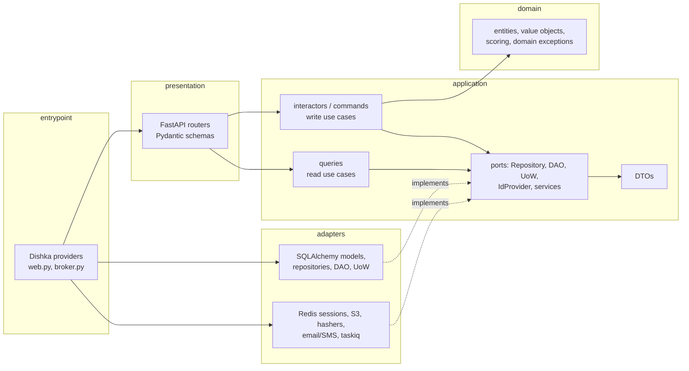

# TappedIn Server

Backend documentation

The TappedIn backend is a FastAPI application built with **Domain-Driven Design (DDD)** and **Clean Architecture**. Business rules live in the inner layers (`domain`, `application`), infrastructure lives in `adapters`, HTTP lives in `presentation`, and the `entrypoint` wires everything together with Dishka dependency injection. The Python package is called `vnu` (the original project name) and is located at `server/src/vnu`.

Back to the [project README](../README.md) | [Client docs](client.md) | [MVP plan](MVP-PLAN.md)

## Technology

- Python 3.12, uv
- FastAPI + Uvicorn
- SQLAlchemy 2.0 (async) + asyncpg, Alembic (+ `alembic-postgresql-enum`)
- Dishka (dependency injection, FastAPI integration)
- Pydantic (HTTP schemas), dataclasses (domain and DTOs)
- Redis (sessions) and taskiq + taskiq-redis (background jobs)
- Argon2 (password hashing), TOTP/OTP (phone login), SHA-256 (user-agent hash)
- boto3 (S3 presigned upload URLs)
- pytest + pytest-asyncio, Ruff

## Architecture



### Layers

```text
server/src/vnu/
├── domain/                 # pure business rules, no framework imports
│   ├── common/             # Entity, ValueObject, UID/URL/Timestamp, base exception
│   ├── entities/
│   │   ├── auth/  user/    # user entity, value objects, enums, permissions
│   │   └── music/          # entities, enums, value_objects, scoring.py
│   ├── exceptions/         # auth, common, music, user
│   └── services/authorization/
├── application/            # use cases and ports
│   ├── common/             # ports: interactor, query, command, uow, auth/idp, music/{dao,repository}, user/*
│   ├── dto/                # input/output dataclasses
│   ├── errors/             # application errors (auth, music, user, ...)
│   ├── interactors/        # write use cases: auth/, user/, otp/, music/
│   ├── commands/           # create_guest
│   ├── queries/            # read use cases: music/, user/
│   ├── schemas/            # Pydantic request models (auth, music, user)
│   └── services/           # session, user, otp services
├── adapters/               # implementations of ports
│   ├── config.py           # env -> dataclass configs
│   ├── auth/               # idp (session id provider), hashers, session processor, token processor
│   ├── data/
│   │   ├── models/         # SQLAlchemy models (user, music)
│   │   ├── dao/            # read side (MusicDAOImpl, UserDAOImpl, SessionDAOImpl on Redis)
│   │   ├── repository/     # write side (MusicRepositoryImpl, UserRepositoryImpl, OtpRepositoryImpl)
│   │   └── migrations/     # Alembic env + versions/
│   ├── uow.py  aws.py  email.py  mailchimp.py  sms_client.py  totp.py  tasks/
├── presentation/http/      # routers/*.py, common.py (router registration + exception handlers)
└── entrypoint/             # web.py (FastAPI app), broker.py (taskiq), di/container.py + providers/
```

### Dependency rule

Source-code dependencies point inward:

```text
presentation ─┐
adapters ─────┼─►  application  ─►  domain
entrypoint ───┘
```

- `domain` imports nothing from the project except `domain`. It has no SQLAlchemy, FastAPI or Pydantic.
- `application` defines **ports** (`Protocol` classes) in `application/common/*` and uses them; it does not know SQLAlchemy.
- `adapters` implement the ports (`MusicRepositoryImpl`, `MusicDAOImpl`, `UoWImpl`, `SessionDAOImpl`, ...).
- `presentation` converts HTTP to DTOs and calls an interactor/query; it contains no business rules.
- `entrypoint` is the only place that knows all concrete classes and binds ports to implementations.

Known deviation: some interactors import `SessionIdProvider` from `vnu.adapters.auth.idp` directly instead of an abstract `IdProvider` port (the port exists in `application/common/auth/idp.py`). It is tolerated in the MVP and tracked as technical debt below.

### Why DDD + Clean Architecture

- **Rules live where they can be tested.** The match score, swipe validation and connection state machine are plain Python and run in milliseconds without a database.
- **Replaceable infrastructure.** PostgreSQL, Redis and S3 sit behind ports; tests swap them for in-memory fakes (`server/tests/application/test_music_interactors.py`).
- **Thin transport.** Routers only validate HTTP input and map output, so a new client (a bot, a web app) can reuse the same use cases.
- **Scales with the team.** Each use case is a small class in its own module; new MVP features were added as vertical slices (domain -> DTO -> port -> interactor -> repository -> router -> provider) with minimal changes to existing code.
- **Fits the MVP plan.** [MVP-PLAN.md](MVP-PLAN.md) prescribes this exact pipeline.

### Peculiarities

- **CQRS-lite.** Writes go through `Interactor`/`Command` + `Repository` + `UoW`; reads go through `Query` + `DAO`. The two sides have separate ports (`MusicRepository` vs `MusicDAO`) and separate implementations, but share one database.
- **Repositories return DTOs on save.** `save_profile(...)` returns a `MusicProfileDTO`, so the write path can respond without a second read.
- **The SQLAlchemy `AsyncSession` is also the `UoW`.** `ConnectionProvider` provides `AnyOf[AsyncSession, UoW]` for the request scope; `commit()` is called explicitly by the interactor.
- **Auth by session id, not JWT.** Sessions are stored in Redis; see below.
- **Legacy template code.** OTP, email, Mailchimp, SMS and Telegram fields come from the original template and are kept because the auth flow reuses them.

## Use Cases

### Interactors (writes)

All interactors subclass `Interactor[InputDTO, OutputDTO]` and implement `async def __call__(self, data)`. Dependencies are constructor-injected ports:

```python
# server/src/vnu/application/interactors/music/swipes.py
class SwipeProfile(Interactor[SwipeInputDTO, SwipeDTO]):
    def __init__(self, repository: MusicRepository, dao: MusicDAO, uow: UoW, idp: SessionIdProvider) -> None:
        ...

    async def __call__(self, data: SwipeInputDTO) -> SwipeDTO:
        profile = await current_profile(self.dao, self.idp)
        target = await self.dao.get_profile_by_id(data.target_profile_id)
        if target is None:
            raise MusicProfileNotFoundError("Target music profile not found.")
        if await self.dao.get_swipe_action(profile.id, target.id) is not None:
            raise DuplicateMusicActionError("Profile already swiped.")

        match = match_score_for(profile, target)
        swipe = Swipe.create(actor_profile_id=profile.id, target_profile_id=target.id,
                             action=data.action, match_score=match.score)
        await self.repository.save_swipe(swipe)
        if data.action == SwipeActionEnum.LIKE:
            await create_or_accept_connection(self.repository, requester=profile, receiver=target,
                                              fail_on_existing_request=False)
        await self.uow.commit()
        return SwipeDTO(...)
```

Music interactors (`application/interactors/music/`): `UpsertMyMusicProfile`, `UpdateMyMusicProfile`, `CreateFeaturedUpload`, `DeleteUpload`, `SwipeProfile`, `RequestConnection`, `AcceptConnection`, `RejectConnection`, `CreateFeedback`, `MarkNotificationRead`, and direct messages: `OpenConversation`, `SendMessage`, `MarkConversationRead`. Auth/user interactors: `SignUp`, `EmailLogin`, `PhoneLogin`, `PhoneLoginVerify`, `Logout`, `VerifyPhone`, `CompleteUser`, `UpdateUser`, `GetByUsername`, `SendOtp`. Command: `CreateGuestCommand`.

### Queries (reads)

Queries subclass `Query[InputDTO, OutputDTO]` and use only DAOs. The recommendation feed is the most interesting one:

```python
# server/src/vnu/application/queries/music/recommendations.py
async def __call__(self, data: RecommendationFiltersDTO) -> list[RecommendationCardDTO]:
    profile = await current_profile(self.dao, self.idp)
    candidates = await self.dao.list_recommendation_candidates(profile.id, data)
    candidates = [c for c in candidates if self._matches_filters(c, data)]
    cards = [RecommendationCardDTO(profile=self._to_feed_profile(c), match=...) for c in candidates]
    return sorted(cards, key=lambda card: card.match.score, reverse=True)[: data.limit]
```

Queries: `GetMyMusicProfile`, `GetMusicProfileById`, `GetRecommendationFeed`, `GetRecommendationScore`, `ListSavedProfiles`, `ListConnections`, `ListMyUploads`, `ListReceivedFeedback`, `ListNotifications`, `ListConversations`, `ListMessages`, `GetMe`.

### Domain model

Entities are dataclasses with factory methods (`MusicProfile.create`, `MusicUpload.create_featured`, `Swipe.create`) that enforce invariants and raise typed domain exceptions (`InvalidMusicProfileError`, `InvalidMusicUploadError`, `InvalidMusicInteractionError`):

- `MusicProfile` - role, artist name, location, experience, bio, collaboration status, optional `MusicIdentity`.
- `MusicIdentity` - genres, influences, type beats, moods, BPM range (rejects `bpm_min > bpm_max`).
- `MusicUpload` - featured audio metadata; creating a featured upload replaces the previous one (exactly one per profile).
- `Swipe` - `skip | like | save` with the match score at action time; self-swipes are rejected.
- `Connection` - `pending -> accepted | rejected`; only the receiver can accept/reject a pending request.
- `Feedback`, `Notification` - structured feedback and minimal notifications.
- `Conversation`, `Message` - direct chat between two users with a stable (ordered) user pair; a message is either `text` (non-blank, stripped) or `beat` (a reference to a `music_upload`, no text). A conversation can only be opened between users with an accepted connection.

Match score (`domain/entities/music/scoring.py`) is deterministic and weighted exactly as in the MVP plan:

```python
weighted = {
    "genre_similarity": round(genre * 35),
    "influences_similarity": round(influences * 30),
    "type_beat_similarity": round(type_beats * 20),
    "location_match": round(location * 10),
    "experience_proximity": round(experience * 5),
}
score = min(100, max(0, sum(weighted.values())))
```

Each term is a set-overlap ratio (`|A ∩ B| / max(|A|, |B|)`), a case-insensitive location equality, or a distance on the experience scale. The result also carries human-readable `reasons` ("Similar genres", "Same location", ...) and the per-term `breakdown`.

## Dependency Injection

Dishka builds the container in `entrypoint/di/container.py`. Configs are passed as **context** (`AwsConfig`, `DatabaseConfig`, `RedisConfig`, ...), and providers are grouped by role:

| Provider | Scope | Provides |
| --- | --- | --- |
| `ConnectionProvider` | APP / REQUEST | `AsyncEngine`, `async_sessionmaker`, per-request `AsyncSession` also exposed as `UoW` |
| `AdaptersProvider` | REQUEST | `SessionIdProvider`, `BearerParser`, hashers, Redis client, S3 file manager, email/SMS/Mailchimp clients |
| `DAOProvider` | REQUEST | `MusicDAOImpl`, `UserDAOImpl` (with all parent protocols via `WithParents`) |
| `RepositoryProvider` | REQUEST | `MusicRepositoryImpl`, `UserRepositoryImpl`, `OtpRepositoryImpl` |
| `InteractorsProvider` | REQUEST | all interactors (`provide_all(...)`) |
| `QueryProvider` / `CommandProvider` | REQUEST | queries and commands |
| `ServiceProvider`, `TaskProvider` | REQUEST / APP | session/user/otp services, taskiq publishers |

Routers receive use cases with `FromDishka[...]`:

```python
@router.post("")
@inject
async def swipe_profile(data: SwipeRequest, interactor: FromDishka[SwipeProfile]) -> Any:
    return await interactor(SwipeInputDTO(target_profile_id=data.target_profile_id, action=data.action))
```

`WithParents[Impl]` registers an implementation under all its base protocols, which is how `MusicDAOImpl` becomes available as `MusicDAO`. To add a use case: write the interactor, add it to `provide_all(...)` in `InteractorsProvider`, add a router function.

## Authentication

- `POST /auth/signup`, `/auth/email/login`, `/auth/phone/verify` create a session through `SessionService.create` and return `{ user, sid }` (also `Set-Cookie: sid=...; HttpOnly; SameSite=Lax`).
- `SessionServiceImpl` generates a 32-byte URL-safe id (`SessionProcessorImpl`), stores JSON in Redis under `sess:<sid>` and indexes it per user (`user:<user_id>` set). Idle lifetime is 30 days, absolute lifetime 60 days; a SHA-256 hash of the `User-Agent` is stored with the session.
- `SessionIdProvider` (REQUEST scope) reads `sid` from the cookie, or from `Authorization: Bearer <sid>`, validates it and returns `UserId`. Failures raise `UnauthorizedError`, which `presentation/http/common.py` maps to `401 {"detail": ...}`.
- `POST /auth/logout` terminates the current session and deletes the cookie.
- Passwords are hashed with Argon2; phone login uses a TOTP code.

## Database Structure

PostgreSQL with SQLAlchemy 2.0 models in `adapters/data/models/` (`Base` + `user.py` + `music.py`). All music tables reference `music_profile` or `user` with `ON DELETE CASCADE`.

- `user` - existing account table (telegram id, username, name, age, gender, avatar, email, hashed password, phone, status `guest | active`, created_at).
- `music_profile` - one per user (`user_id` unique): role, artist name, avatar, location, experience level, bio, collaboration status, timestamps.
- `music_identity` - one per profile: `genres`, `influences`, `type_beats`, `moods` (JSONB arrays), `bpm_min`, `bpm_max`.
- `social_link` - profile social links; unique `(profile_id, platform)`.
- `music_upload` - audio URL, title, genre, tags, BPM, description, `is_featured`.
- `swipe` - `skip | like | save` with `match_score`; unique `(actor_profile_id, target_profile_id)`, check `actor <> target`.
- `connection` - requester/receiver profile, status `pending | accepted | rejected`; unique normalised pair `(pair_first_profile_id, pair_second_profile_id)` makes the pair unordered; check `requester <> receiver`.
- `feedback` - author profile, target upload, category, quick reaction, text.
- `notification` - user, type (`connection_accepted | new_feedback`), JSON payload, `is_read`.
- `conversation` - direct chat between two users: `user_1_id`, `user_2_id` (check `user_1_id::text < user_2_id::text` and unique pair, so a pair has exactly one conversation), `last_message_at`; indexed by both users and by `last_message_at`.
- `message` - `conversation_id`, `sender_id`, type `text | beat`, `text` (<= 2000), `beat_id` (-> `music_upload`, `SET NULL`), `read_at`; check constraint `ck_message_payload` keeps text/beat payloads consistent; index `(conversation_id, created_at)`.

Redis stores sessions (`sess:*`, `user:*`) and is the taskiq broker.

## Migrations

Alembic is configured in `server/alembic.ini`; `adapters/data/migrations/env.py` builds the URL from `Config.load_from_environment()` and uses `Base.metadata`. Revisions are in `adapters/data/migrations/versions/`:

```text
2026_05_26_0000-9f2a91d6d8d3_legacy_template_baseline.py
2026_10_04_1530-a1b2c3d4e5f6_add_tappedin_mvp.py
2026_10_05_0300-b2c3d4e5f6a7_add_telegram_social_platform.py
2026_10_05_0600-c3d4e5f6a7b8_add_direct_messages.py
```

The compose `backend` service runs `alembic upgrade head && python -m vnu.entrypoint.web`, so the schema is always current after `docker compose up`. The `versions/` directory is bind-mounted, so revisions generated inside the container (`make revision m="..."`) appear on the host. Ruff excludes the migrations directory.

## API Reference

All routers are registered in `presentation/http/common.py`. Auth is required unless marked public. Errors are JSON `{ "detail": "..." }`: `401` unauthorized, `403` forbidden / invalid interaction, `404` not found, `409` duplicate or invalid action, `422` validation, `400` other application errors.

| Method and path | Description |
| --- | --- |
| `GET /health` | Liveness probe (public) |
| `POST /auth/signup` | Create user and session (public) |
| `POST /auth/email/login` | Email + password login (public) |
| `POST /auth/phone/login` | Send OTP to phone (public) |
| `POST /auth/phone/verify` | Verify OTP, create session (public) |
| `POST /auth/phone/activate` | Activate phone with code |
| `POST /auth/logout` | Terminate session |
| `POST /users/guest` | Create guest user (public) |
| `GET /users/me`, `PATCH /users/me` | Current user, update account |
| `POST /users/me/complete` | Complete account data |
| `GET /users/by-username/{username}` | Look up user by username |
| `GET /profiles/me`, `POST /profiles/me`, `PATCH /profiles/me` | Read / create-or-complete / update music profile, identity and socials |
| `GET /profiles/{profile_id}` | Public profile details |
| `POST /uploads/presigned-url` | S3 presigned PUT URL for audio/avatar |
| `POST /uploads/featured` | Create or replace featured upload |
| `GET /uploads/me` | My uploads |
| `DELETE /uploads/{upload_id}` | Delete upload |
| `GET /recommendations/feed?role=&genre=&location=&limit=` | Feed cards with match score (`limit` 1-50, default 10) |
| `GET /recommendations/{profile_id}/score` | Score breakdown |
| `POST /recommendations/{profile_id}/send-request` | Shortcut for a `like` swipe |
| `POST /recommendations/{profile_id}/decline` | Shortcut for a `skip` swipe |
| `POST /swipes` | Record `skip`, `like` or `save` |
| `GET /swipes/saved` | Saved profiles |
| `GET /connections` | Accepted and pending connections |
| `POST /connections/{profile_id}/request` | Send connection request |
| `POST /connections/{connection_id}/accept` | Accept request |
| `POST /connections/{connection_id}/reject` | Reject request |
| `POST /feedback` | Create quick or text feedback for an upload |
| `GET /feedback/me` | Feedback received on my uploads |
| `GET /conversations` | My direct conversations |
| `POST /conversations/{user_id}` | Open (or return) the direct chat with a connected user |
| `GET /conversations/{conversation_id}/messages?limit=&before=` | Message history (latest page, chronological) |
| `POST /conversations/{conversation_id}/messages` | Send a `text` or `beat` message |
| `POST /conversations/{conversation_id}/read` | Mark the other user's messages as read |
| `GET /notifications` | List notifications |
| `POST /notifications/{notification_id}/read` | Mark notification as read |

Interactive docs: http://localhost:8000/docs.

## Configuration

`adapters/config.py` loads environment variables (and `.env` via `python-dotenv`) into frozen dataclasses: `DatabaseConfig`, `RedisConfig`, `AwsConfig`, `EmailConfig`, `MailchimpConfig`, `SmsConfig`. Host/port resolution is Docker-aware: when `DB_HOST=postgresql` (or `REDIS_HOST=redis`) and the app is **not** running in Docker (`/.dockerenv` or `RUNNING_IN_DOCKER=1` absent), the config falls back to `localhost:$LOCAL_DB_PORT` (`LOCAL_REDIS_PORT`). That is why the same `server/.env` works inside compose and on the host. See `server/.env.example` for all variables.

## Running the Server Alone

Everything in Docker (PostgreSQL + Redis + backend + worker + scheduler), from the repository root:

```bash
make env                # once: creates server/.env, then edit it
make server-up          # docker compose up --build postgresql redis backend worker scheduler
```

or from `server/` with the original convention:

```bash
cd server
docker compose -f docker-compose.dev.yml up --build
```

Backend on the host, infrastructure in Docker:

```bash
docker compose up -d postgresql redis                   # from the repository root
cd server
uv sync --extra test
uv run alembic upgrade head
uv run python -m vnu.entrypoint.web                     # http://localhost:8000
curl http://localhost:8000/health
```

Compose files: `server/docker-compose.base.yml` defines services, `docker-compose.dev.yml` extends them, `docker-compose.test.yml` adds a `unit` runner (`pytest -v -s`) and a Newman `e2e` runner. The `Dockerfile` is a two-stage uv build (dependencies layer, then project) with `server/.dockerignore` excluding `.venv`, caches and `.env`.

## Tests

```bash
cd server
uv run --extra test pytest tests -q          # server unit tests
uv run --extra test pytest ../tests -q       # root-level unit + end-to-end tests
E2E_BASE_URL=http://localhost:8000 uv run --extra test pytest ../tests/end2end -q
```

- `server/tests/domain/test_music_domain.py` - deterministic and weighted match score, self-swipe rejection, connection acceptance rules.
- `server/tests/application/test_music_interactors.py` - interactors against in-memory fake repositories/DAOs: featured upload replacement, reciprocal like -> accepted connection + notifications for both users, feed shape and ordering.
- `server/tests/domain/test_conversations.py` and `server/tests/application/test_conversations.py` - stable conversation pair, text/beat message invariants, chat requires an accepted connection, sender comes from the session, read receipts, history paging.
- `server/tests/adapters/test_session_idp.py` - `SessionIdProvider` reads `sid` from a bearer header, prefers the cookie, rejects missing or malformed credentials.
- `tests/unit/` (root) - feed card shape, filtering of profiles without preview or already declined, decline and send-request behaviour.
- `tests/end2end/` (root) - contract tests against a running backend: `/health`, `401` on protected routes, new routes present in OpenAPI. They skip automatically when `E2E_BASE_URL` is unreachable.

Because use cases depend on ports, almost every business rule can be tested without PostgreSQL or Redis. Ruff (`select = ALL`, line length 120) is the lint gate; migrations are excluded.

## Trade-offs and Technical Debt

- **Application imports an adapter type.** Interactors take `SessionIdProvider` from `adapters.auth.idp`; they should depend on the `IdProvider` port instead.
- **Feed scoring in Python.** Candidates are fetched and scored in memory; filtering and pagination should move into SQL (or a materialised score) for large user bases.
- **Debug mode and permissive logging.** `FastAPI(debug=True)` and DEBUG-level logging are enabled in `entrypoint/web.py`; CORS allows only `http://localhost:5173` and `http://0.0.0.0:8000`. Both must be configured for production.
- **Compose start-up order.** `depends_on` does not wait for the PostgreSQL healthcheck; the backend relies on `restart: on-failure`.
- **Fixed container names and ports** (`backend`, `postgresql`, `redis`, 8000/5433/6380) mean one stack per machine.
- **Template leftovers.** OTP/email/Mailchimp/SMS adapters and Telegram fields are present but not required by the TappedIn flows.
- **No audio processing.** Uploads are stored as URLs; there is no transcoding, waveform or audio-embedding based matching (explicitly out of the MVP).
